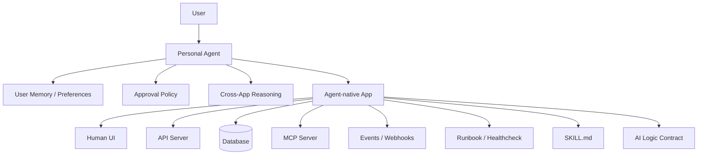

# Architecture

Agent-native App Architecture separates deterministic application behavior from AI decision-making.

## Core idea

```text
App = reliable state + UI + API + tools + events
Personal Agent = AI runtime + user memory + cross-app reasoning
```

The app does not need to know which model or agent the user prefers. It only needs to expose clear capabilities, state, events, and write-back contracts.

## Layer diagram



## Responsibilities

### App responsibilities

- maintain durable state
- enforce deterministic business rules
- validate input and output
- expose tools and resources through MCP
- emit events when AI intervention may be useful
- provide human UI for visibility and override
- document deployment and operations

### Personal agent responsibilities

- decide when to use the app
- interpret user intent
- read app state through MCP/API
- execute AI decision points declared by the app
- ask for approval when required
- write structured results back to the app
- coordinate with other apps

## Design principle

Do not put fragmented, product-specific AI brains inside every app.

Instead, let apps expose **AI hooks** and let the user's personal agent execute the AI logic with the user's long-term context.

## Service boundary principle

Keep the agent environment clean.

The app should own its runtime data, database, migrations, uploads, and operational lifecycle. The agent should install lightweight guidance and connectors: Skills, MCP configuration, and approval policy.

This keeps the app portable across agent runtimes and prevents the personal agent home from becoming a dumping ground for every service's state.
